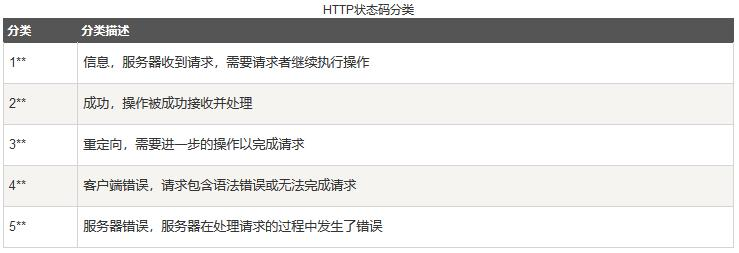

<ul>
常见状态码：
<li>
200 OK //客户端请求成功
</li>
<li>
400 Bad Request //客户端请求有语法错误，不能被服务器所理解
</li>
<li>
401 Unauthorized //请求未经授权，这个状态代码必须和
WWW-Authenticate 报头域一起使用
</li>
<li>
403 Forbidden //服务器收到请求，但是拒绝提供服务
</li>
<li>
404 Not Found //请求资源不存在，eg：输入了错误的URL
</li>
<li>
405 method not allowed 請求方式不支持
</li>
<li>
500 Internal Server Error //服务器发生不可预期的错误
</li>
<li>
503 Server Unavailable //服务器当前不能处理客户端的请求，一段时
间后可能恢复正常
</li>
</ul>

